# DUSTLINE — world components

## What a component is

**One file. Geometry, physical rules, and preview, together.**

```
src/world/props/tyreStack.ts   ->  appears in the palette, scatterable,
                                   placeable, collidable, previewed
```

That colocation is the whole idea. Before this, an object's parts were spread
across the codebase: the pine's geometry was built in one loop in
`render/scenery.ts`, its collider was created ninety lines later in the same
loop, its placement rules were three `if`s in between, and its palette entry did
not exist because there was no palette. Changing a tree meant touching all of
them and hoping. A component keeps them in one place, where a mismatch is
visible.

## Adding one

Create `src/world/props/<id>.ts` with a default export. **There is no manifest
to update** — the registry discovers every file in the folder, so a new file is
a new component in the palette on the next reload.

```ts
import { PropTemplate, boxAt, cylinderAt, standard } from './types';

const barrier: PropTemplate = {
  id: 'barrier',
  name: 'Barrier',
  category: 'trackside',
  description: 'Concrete block. Solid, heavy, ends a bad line.',

  // Built ONCE per world and instanced. Local space, base at y = 0.
  build: () => [
    { key: 'body', geometry: boxAt(3.2, 0.9, 0.6, 0), material: standard(0xcfcabd), castShadow: true },
    { key: 'foot', geometry: boxAt(3.4, 0.18, 0.9, 0), material: standard(0xa8a294) },
  ],

  // The physical rules travel with the object.
  physics: {
    shape: (s) => ({ kind: 'box', halfExtents: [1.6 * s, 0.45 * s, 0.3 * s], centerY: 0.45 * s }),
    solid: true,
    massKg: 2200,
  },

  // How it may be placed and scattered.
  authoring: {
    scale: [0.9, 1.2],
    defaultScale: 1,
    minRoadDist: 7,
    randomYaw: false,
  },
};

export default barrier;
```

That is the entire contract. No registration, no palette entry, no thumbnail to
draw, no collider code elsewhere.

## The three parts

### Geometry — `build()`

Returns **parts**, not a finished object, because a world holds hundreds of
copies. Each part becomes one `InstancedMesh` shared by every instance, so 260
pines with four parts cost four draw calls rather than 1,040.

Two per-instance hooks:

- `tint(ctx)` — per-instance colour. The pine uses it to grow duller on snow.
- `when(ctx)` — per-instance opt-out. The pine's snow cap only exists on snow.

`ctx` carries where the instance is going and what it is standing on:
`{ x, z, y, ground, depth, surface, scale, rng }`. `y` is where the component's
base sits, `ground` is the terrain under it and `depth` is how much water is
over that — for anything on dry land all three agree.

### Physical rules — `physics`

- `shape(scale)` — the collider, **as a function of scale**. A collider that
  ignores instance scale is the classic invisible-wall bug: a small rock you can
  drive over and a large one you cannot must not share a hitbox.
- `solid` — `true`, `false`, or a predicate on scale. The rock is solid only
  above 1.1, which is exactly the rule the old scatter loop had buried in it.
- `massKg`, `friction` — recorded now because they are properties of the object.
  Inventing them per-object later is how a hay bale ends up heavier than a
  boulder.

Non-solid components get **no collider at all**, however large they look. The
bush is dressing and always has been.

### Authoring — `authoring`

`scale` range, `defaultScale` when dropped from the palette, `avoidSurfaces` and
`minRoadDist` for scattering, `randomYaw`. Scatter layers may override any of
these; hand placement never restricts you — if you put a saguaro on a glacier,
you meant to.

`placement` says what the component stands on, and defaults to `land`:

| | scatter puts it | its base sits at |
|---|---|---|
| `land` | anywhere dry | the ground |
| `water` | in water at least `minDepth` deep | **the water surface** |
| `shore` | on dry land within `shoreBand` m of the waterline | the ground |

A floating component floats **wherever you put it**, including by hand in the
middle of a field — "it is a boat" is a fact about the component, not about
where it was dropped. That is why a rowboat in 1 m of water and one in 8 m sit
at the same height without either of them knowing the depth: their zero *is*
the waterline. Scatter is the only thing `placement` filters.

### Preview — nothing to write

Thumbnails are rendered from `build()` output by `props/thumbnail.ts`, framed
from the measured bounding sphere. A hand-drawn icon is a picture that starts
accurate and silently stops being; this one cannot disagree with the object
because it *is* the object.

## Getting one into a world

**Scatter** — fills a landscape by rule. A layer names a component:

```json
{ "template": "pine", "count": 260, "minRoadDist": 11, "minSpawnDist": 62, "spread": 0.944 }
```

**Placement** — puts one somewhere on purpose:

```json
{ "template": "tyreStack", "x": 150, "z": -85, "rot": 0, "scale": 1 }
```

Both go through the same builder (`world/build.ts`) into the same instanced
meshes, so a hand-placed pine costs nothing over a scattered one.

Placed props do **not** store their ground height — it is looked up at build
time, so editing the terrain under a prop moves the prop with it. That is the
behaviour you want every single time.

## Placing them in the editor

- **Drag** a palette entry onto the map, or onto the **3D view** — the 3D drop
  raycasts the real terrain, so it lands where the cursor is even on a hillside.
- **Click** a palette entry to arm it, then click the map. Hold `shift` while
  clicking to stay armed — the "twenty tyre stacks along one corner" workflow.
- Selected props: drag to move, `[` `]` rotate, `-` `=` resize, arrows nudge
  (`shift` for 5 m), `ctrl+D` duplicate, `del` remove, `esc` deselect.
- The **PLACED** tab lists every one with exact numbers, and states whether it
  is solid at its current scale and what it weighs — read from its own file.

On the map, props are drawn by **category colour** with a heading tick, at their
real collider footprint but never smaller than a few pixels: drawn honestly to
scale, a 0.66 m tyre stack is a third of a pixel with the whole world in view,
which is invisible exactly when you need to find it.

## Determinism

Each component's scatter draws from its own named stream forked off the track
seed, so **adding rocks never moves the trees**. Placed props draw from a
separate stream again, so hand-placing something does not reshuffle the
scattered world around it.

## The sets

Rendered by the real engine from whatever is in `src/world/props/` — regenerate
with `npm run make:sets`. The orange block at the left of each row is a car
(1.9 x 3.9 m), because the one thing a catalogue has to tell you is how big
things are, and nothing answers that except seeing them next to a car.

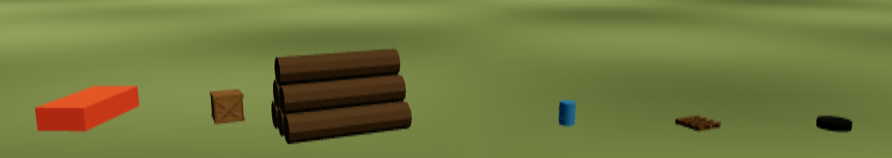
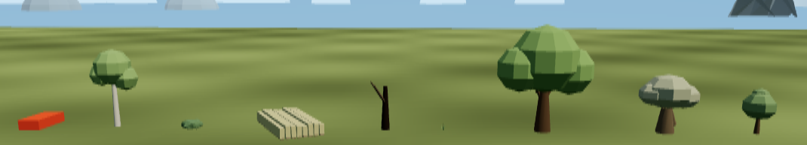
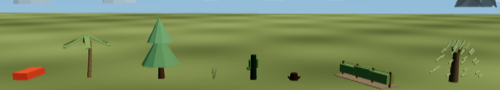
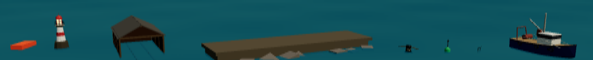
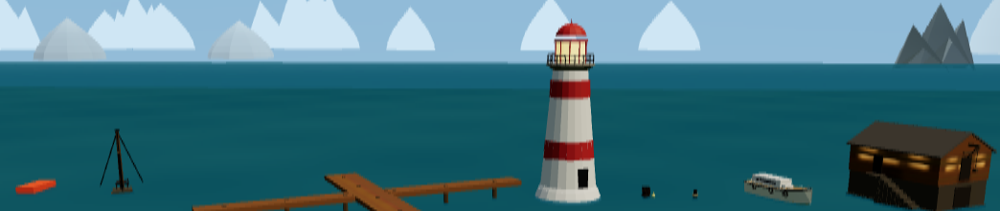

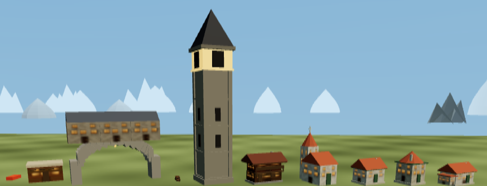
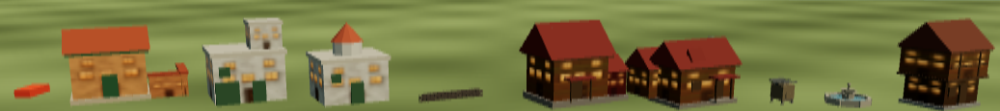
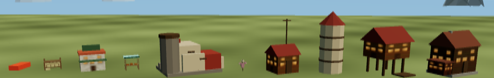
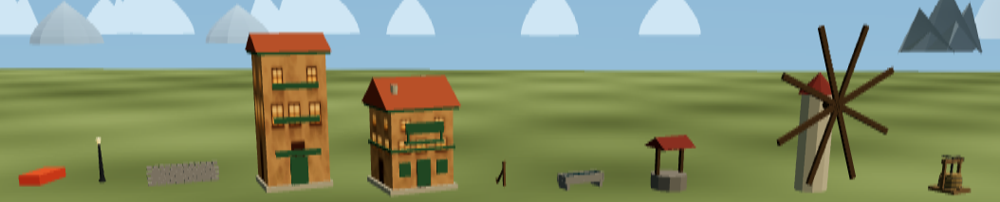
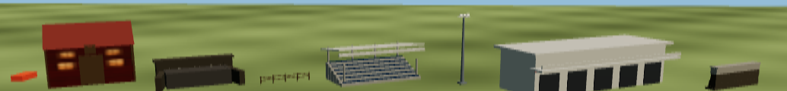
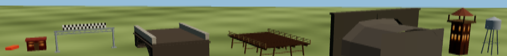
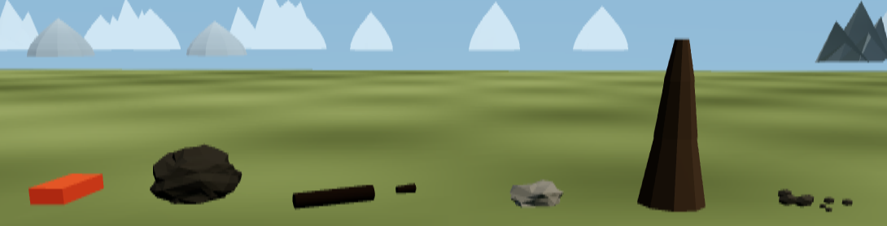
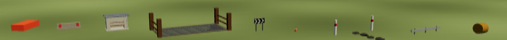
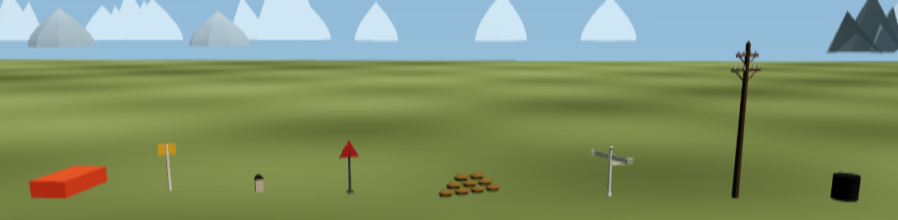

Order in each sheet is alphabetical, after the car:

- **debris** — Crate · Log pile · Oil drum · Pallet · Spare tyre
- **flora-1** — Birch · Bush · Crop row · Dead tree · Grass tuft · Oak · Olive · Orchard tree
- **flora-2** — Palm · Pine · Reeds · Saguaro · Stump · Vine row · Willow
- **marine-1** — Beacon · Boat shed · Breakwater · Capstan · Channel buoy · Dock ladder · Fishing boat
- **marine-2** — Harbour crane · Jetty · Lighthouse · Lobster pots · Mooring post · Motor launch · Net loft
- **marine-3** — Quay steps · Quay wall · Rowboat · Sailboat · Slipway
- **settlement-1** — Adobe house · Arch gateway · Barrel stack · Campanile · Chalet · Church · Cottage · Cottage, hipped · Cottage, long
- **settlement-2** — Courtyard house · Cube house · Domed house · Dry-stone wall · Farmhouse · Farmhouse, L-plan · Feed bin · Fountain · Half-timbered house
- **settlement-3** — Hay rack · Kiosk · Market stall · Pueblo ruin · Scarecrow · Signal hut · Silo · Stilt house · Stone cottage
- **settlement-4** — Street lamp · Terrace wall · Tower house · Townhouse · Trellis post · Water trough · Well · Windmill · Wine press
- **structure-1** — Barn · Culvert · Fence run · Grandstand · Light mast · Pit building · Retaining wall
- **structure-2** — Shed · Start gantry · Stone bridge · Timber bridge · Tunnel mouth · Watchtower · Water tower
- **terrain** — Boulder · Fallen log · Rock · Rock spire · Scree
- **trackside-1** — Barrier block · Bus shelter · Cattle grid · Chevron board · Cone · Ford stones · Guardrail · Hay bale
- **trackside-2** — Marshal post · Milestone · Road sign · Sandbag wall · Signpost · Telegraph pole · Tyre stack

The marine sheet is shot **afloat** — on a flooded shelf rather than a lawn.
Every component in it either floats or stands at the water's edge, and a
rowboat photographed on grass shows you the two inches of gunwale that clear
it rather than the boat.

## Where the shapes come from

**The dwellings, the boats and the lighthouse are IGNITE RALLY's, copied
across.** They are not dustline designs and were never meant to be: the other
game in this repository has eighteen worked dwelling archetypes in a data table
(`src/world/catalog.js`), a boat hull lofted through nine stations with a hard
chine, and a lighthouse with a corbelled gallery you can count the stanchions
on. dustline's first cut of all three was hand-rolled boxes, and the v1 sources
say plainly what that looks like from the driving seat — its own first boats
were "a BOX WITH A CONE ON TOP", its own first lighthouse "read as a traffic
bollard from the quay".

So the port is verbatim, comments included, and three files carry it:

| file | from | what |
|---|---|---|
| `templates/geometry.ts` | `track.js` | primitives, hull loft, sail loft, strut-between-two-points, bundle, gable prism |
| `templates/buildings.ts` | `world/catalog.js` | `HOUSE_TEMPLATES` and the colour kits |
| `templates/boats.ts` | `track.js` | rig, deck gear, trawler gantry, coachroofs, fenders |
| `templates/textures.ts` | `textures.js` | the window tile and its emissive companion |
| `templates/horizon.ts` | `world/sky.js` | the six skyline silhouettes |

**They all live in `src/templates/`** — see the README in that folder. The line
is: *templates are what a thing is made of; `world/props/` is what a thing is.*
Three of these used to sit in `world/props/` because that is where they were
first needed, which meant the component registry had to skip them by inspection
and anything outside that folder wanting a hull or a gable roof had to reach
into a folder about something else. `world/props/` is now 109 components and
three files of infrastructure, and nothing else.

A settlement component is then a name and a sentence — `dwelling({ template:
'cottageA', kit: 'dalmatia', … })` — with no geometry in it left to get wrong.

The boundary is **checked, not described**: `npm run verify:templates` fails if
a template acquires a runtime dependency on the component catalogue, if one of
them does something on import, if the barrel stops re-exporting a file, if two
files declare the same name (`export *` drops it silently, which fails at the
import site rather than anywhere useful), or if a non-component turns up in
`world/props/`. It caught two real leaks the moment it was written — `boats.ts`
and `buildings.ts` were pulling values back out of `props/types.ts`, which is
the exact tangle the folder was created to end.

**Windows are a texture, and it is v1's.** `buildingTexture` draws the panes,
frames, glazing bars, sills and door into a 256 tile, and
`buildingGlowTexture` is the same tile black except the glass — so one extra
map lights every dwelling in the world at dusk with no light source and no
per-house cost. Its own comment states the split: the pane colour is the
albedo half, the emissive map is the glow.

That texture is why kind `wall` is its own part even when it shares a colour
slot with something else. The stone cottage's outside stair is written in the
same `stone` slot as the block it climbs; merged, the steps would get windows.
It is also why `mergeGeomsUV` exists next to `mergeGeoms` — the plain merge
drops UVs on purpose, and a merged wall without them samples one texel across
its whole face, which is a solid box where the windows should be. The first
cut of this port did exactly that and shipped dwellings with their massing and
none of their windows.

A kit picks between two v1 wall surfaces: the **planks** of `buildingTexture`
for the timber kits, and the **limewash** of `townhouseTexture` ("patchy
limewash erosion, so a terrace of identical units is not identical") for the
rendered ones. v1 planks every wall and lets the kit colour multiply it, which
makes a limewashed harbour come out mud.

**Two things were repaired in the port, and they are marked in the file.** A
rolled part in a house template is still BASE-anchored, so it radiates one way
from its origin rather than spanning it. That is right for the pueblo ruin's
protruding vigas and wrong for a diameter: the windmill's four sails, written
45° apart, came out as a 135° FAN with every arm on one side of the hub, and
the well's winch barrel hung 2.6 m out past one post. Rendering the library is
what made both visible. They are bugs in the v1 table too.

## The library — 109 components

One file each, discovered from the folder. The table below is the shape of the
library rather than an inventory — the sheets above are the inventory, and they
are rendered from whatever is in `src/world/props/` today.

| category | components | solid |
|---|---|---|
| **flora** | Pine, Birch, Oak, Willow, Palm, Saguaro, Dead tree, Stump | yes |
| | Bush, Reeds | no |
| **terrain** | Rock (above 1.1 scale), Boulder, Rock spire, Fallen log | yes |
| | Scree, Rock (below 1.1) | no |
| **trackside** | Tyre stack, Hay bale, Marshal post, Chevron board, Barrier block, Guardrail, Sandbag wall | yes |
| | Cone | no |
| **structure** | Barn, Shed, Grandstand, Pit building, Watchtower, Water tower, Light mast | yes |
| | Start gantry, Fence run | no |
| **settlement** | Cottage, Cottage (hipped), Cottage (long), Stone cottage, Half-timbered house, Chalet, Tower house, Townhouse, Farmhouse, Farmhouse (L-plan), Church, Windmill, Silo, Well, Kiosk, Market stall, Street lamp | yes |
| | Dry-stone wall | no |
| **marine** | Rowboat, Motor launch, Sailboat, Fishing boat, Jetty, Lighthouse, Mooring post | yes |
| | Channel buoy, Lobster pots | no |
| **debris** | Oil drum, Crate (0.7 scale and up) | yes |
| | Pallet, Spare tyre, Crate (below 0.7) | no |

**Settlement and marine exist because the library had no people in it.** There
were farm buildings and trackside furniture, and nothing anybody lived in. A
dry-stone wall is not solid for the same reason a fence run is not — a wall
that stops a rally car dead turns every field into a pen — and a channel buoy
is a plastic float on a chain, not a bollard.

**Eleven dwellings, not three.** That number is not padding: the v1 table's own
comment records why it grew from three, and it is the single best sentence in
either codebase about content — *"A VILLAGE OF THREE HOUSES IS A VILLAGE OF ONE
HOUSE."* Three silhouettes, hue-jittered, reads as the same building stamped
down the road. They differ in PLAN and ROOFLINE, not tint.

**Barn, shed and watchtower moved onto the same templates.** They were
dustline's own boxes, and a farmyard containing a v1 farmhouse and a dustline
barn looks like two different games sharing a field — which is what it was.

**Four more sets landed together, built in parallel** — a stone harbour (quay
wall, steps, slipway, breakwater, capstan, ladder, boat shed, net loft, crane,
beacon), roads and crossings (stone and timber bridges, culvert, tunnel mouth,
retaining wall, cattle grid, milestone, signpost, road sign, ford stones), a
vineyard and farmland (vine rows, trellis, terrace wall, wine press, barrel
stack, olive and orchard trees, crop rows, hay rack, trough, feed bin,
scarecrow), and a civic set that also exposed seven templates already sitting
in the ported table with nothing pointing at them.

Three things came out of building them that are worth more than the assets:

- **`PhysicsShape` could offset in Y and nowhere else.** That is fine for a
  tree and wrong for anything that RUNS OUT from its origin, and the jetty had
  already shipped with 22 m of deck and a hitbox centred on the shore end. It
  now offsets in X and Z, rotated by the instance's yaw.
- **Scatter had a `minRoadDist` and no maximum.** Ground cover is only worth
  paying for where it is seen, so a layer may now band itself to the road
  corridor with `maxRoadDist` — the same density beside the car for a fraction
  of the count.
- **Box colliders ignored the instance's rotation.** A 12 m barn at 45 degrees
  had an axis-aligned hitbox covering a quite different footprint from the barn.
- **A deck you drive over cannot be a solid lump.** The bridges take the deck
  slab only, with the parapets deliberately not solid, and both files say so:
  falling through a bridge is a far worse bug than driving through its parapet,
  and one convex shape per component cannot have both.

Pine, Rock and Bush are ports of the three hardcoded scenery kinds, geometry
and colliders unchanged, so the shipped world still looks and drives as it did.

**The non-solid choices are decisions, not omissions.** A traffic cone that
stops a rally car is the most immersion-breaking object a track can contain, so
the cone marks a line and never blocks one. A start gantry you can hit is one
you WILL hit on the opening lap of a four-car grid. A field fence should
splinter, and until there is destruction to splinter it, driving through is
closer to the truth than bouncing off. A pallet lies on the ground and you drive
over it. Each of those is written in the component's own file, next to the
geometry it applies to, where it can be argued with.

## Checks

`npm run smoke:components` sweeps **the whole library**, not a sample — it reads
whatever is in the folder today, so a component added tomorrow is covered
without touching the test. For every one it checks that `build()` returns parts
with non-empty, NaN-free geometry; that `physics.shape()` answers with positive
dimensions at both ends of the component's own scale range; and that a
thumbnail renders. Then it places one of every component, loads them all in the
**game**, and requires each to have exactly the collider its file declares —
87 solid, 22 not, all correct.

It then loads the harbour track and reads the **actual instance matrices** out
of the built world, checking that every floating component came out at the
water level and every land one on the ground. That check is written that way on
purpose: the first version restated the placement rule instead of measuring the
result, and passed happily with the builder deliberately broken to put boats on
the seabed.

That last check found its own bug first: with the scatter layers still in place,
colliders from nearby scattered pines were being counted against a placed
pallet, reporting a non-solid component as solid. The test now clears the
scatter, because isolating the thing under test is the difference between a
check and a coincidence.

## The proving ground

`src/data/tracks/proving-ground.json` is a second built-in track that exercises
the library as content: 114 placed components across every category, positioned
relative to the racing line — guardrail runs spaced by the component's own 6 m
length, tyre stacks on the outside of the hairpin, chevron boards on its
approach, a hay-bale chicane, cones marking a narrowing, and a farm, water tower
and pit complex out in the country.

It is *generated* (`node tools/make-proving-ground.mjs`) rather than
hand-written, because placing 114 props by typing coordinates is exactly the
work the editor exists to remove — and because anything positioned relative to
the road has to be recomputed when the road moves. Open it in the editor and
edit it like any other track; the generator only makes the starting point.

## Placed, not just built

A component that exists and is in no world is a catalogue entry. Both showcase
tracks now carry the new sets as content:

- **Harbour Point** gained a stone quay — wall, steps, ladders, capstans, a
  crane, a net loft, a slipway with its boat shed, and a mole with a beacon on
  the end of it — a terraced vineyard on the eastern slope, and road furniture
  round the lap.
- **The proving ground** gained the roads and crossings set beside the route, a
  hamlet of the seven newly-exposed dwelling archetypes, and a farmyard.

Three things had to be fixed to get there, and all three were found by looking
at the render or by the gate rather than by reading the code:

- **The quay wall stood at the waterline** and showed 46 cm of coping. A quay
  wall stands at the top of the bank it retains, so the generator marches
  inland until the ground is 1.9 m clear of the water and puts it there.
- **The vineyard was planted across the road.** Vine rows are not solid, so it
  drove perfectly and looked absurd.
- **The mole was declared `shore` and its geometry authored relative to the
  WATER**, which is how v1 builds one. Run out across a harbour mouth it ended
  up 12 m under. It is `water` placement now, and the smoke test caught it by
  reading the built world.

## The harbour

`src/data/tracks/harbour.json` is a third built-in track and the one that
exercises water: a coast made by ramping the land below the water level, a
village of thirty-odd dwellings along the shore, three jetties with boats
moored off them, a lighthouse on the headland, and buoys and willows scattered
by rule onto the water and along the shoreline.

Like the proving ground it is *generated* (`npm run make:harbour`), and for one
extra reason. The shoreline is not a thing anybody typed — it is wherever the
land crosses the water level — so it MOVES whenever an octave, a ramp or the
level changes. Every piece of the village is placed relative to the shore found
by marching outwards from dry land, which is why the whole harbour stays on the
harbour when the terrain is edited.
