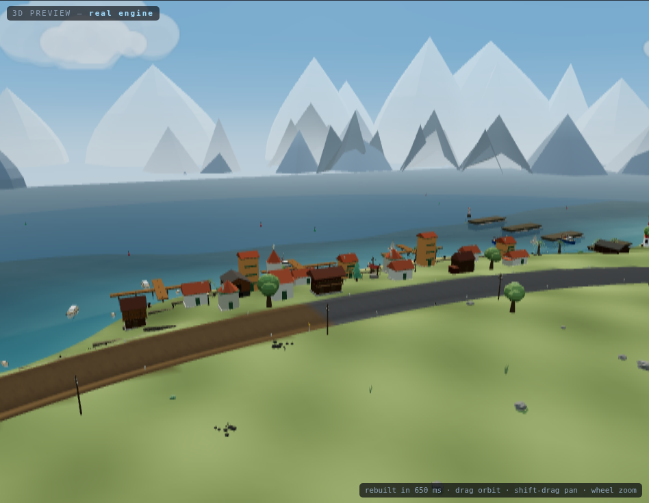
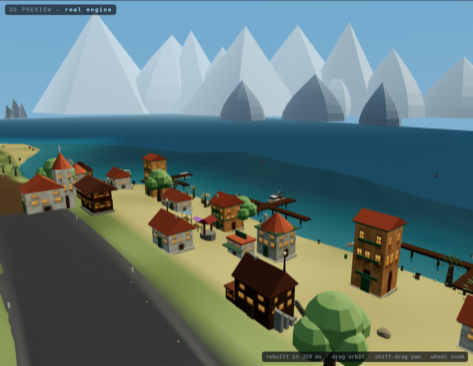
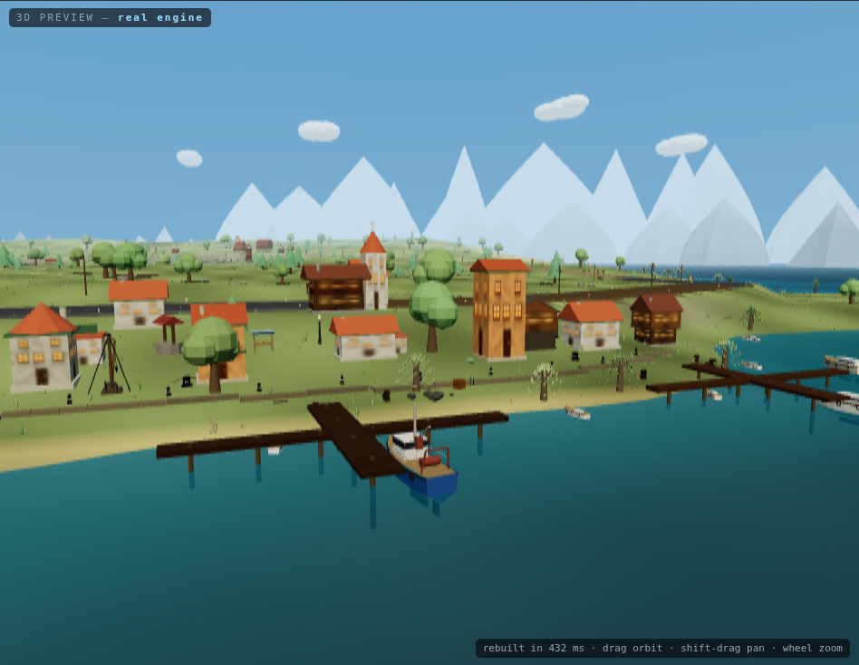
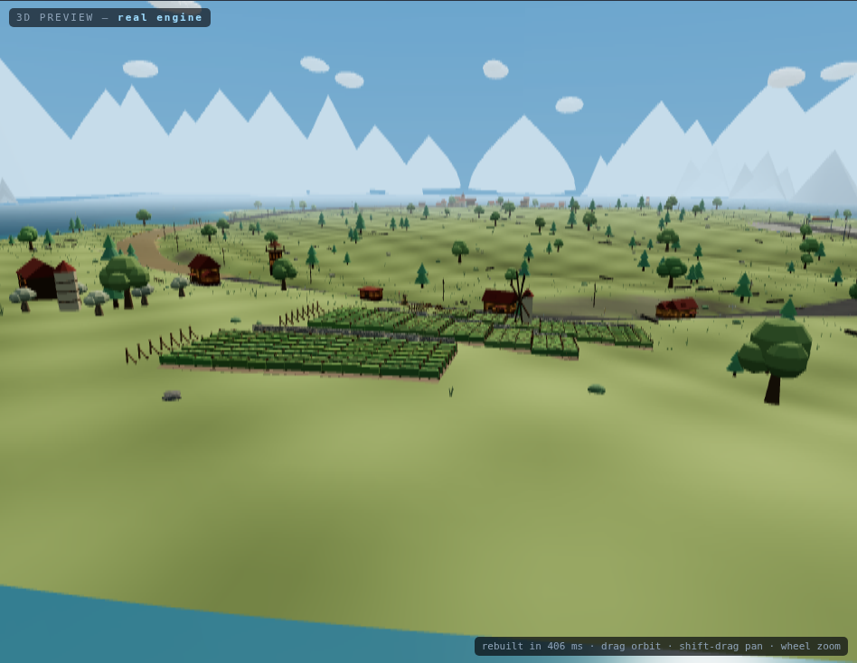

# DUSTLINE — tracks, and the editor

## Why this exists

A track used to be a literal inside `Terrain`'s constructor, and a world's
character lived in three hand-written functions: `hills()` decided the
landscape, `roadHeight()` decided the crests, `surfaceIdAt()` decided where the
snow, mud, sand and gravel were — with the snow line at `z < -150`, the mud at
`(-210, 160) r 80`, and the sand at `x > 190`, typed in as comparisons.

That is workable for one track and impossible for twenty-five. It also means
every change to a world is a code change, which is the actual complaint that
started this: *"I waste too much time asking Claude Code to fix the worlds. I
want to do it manually and create new ones."*

So tracks are data now, and there is an editor that authors them.

## Open the editor

```bash
cd dustline
npm install
npm run dev          # then open /editor.html
```

Or in the published build: **`/racing-shooter/play-dustline/editor.html`**.

Two tracks ship: **DUSTBOWL LOOP**, the original world written out as data, and
**PROVING GROUND**, a circuit carrying 114 placed components that exercises the
whole library as content. Open either from the toolbar.

## What a track is

One JSON file — see `src/data/tracks/dustbowl.json` and the typed shape in
`src/tracks/trackDef.ts`. Everything that used to be hardcoded is a field:

| section | what it controls |
|---|---|
| `road` | the closed loop's control points, half-width, verge blend, sample count |
| `start` | the flat apron at the start line, its surface, the painted tuning rings |
| `terrain.octaves` | the rolling country — stacked waves over the map |
| `terrain.ramps` | one-sided slopes, e.g. "the north rises to a snow line" |
| `terrain.road` | the road's own elevation: waves over the lap, plus crests (jumps) |
| `surfaces.bands` | stretches of the lap with their own surface |
| `surfaces.zones` | regions that override the surface, with optional patches (ice) |
| `water` | optional: one level, below which everything is under water |
| `scenery` | per-layer scatter: which COMPONENT, how many, clearances, scale |
| `props` | hand-placed components: what, where, rotation, scale |
| `sky` | dome gradient, fog, sun, fill light, horizon massifs, clouds |
| `seed` | every scattered object derives from this — same seed, same world |

The format is designed so `dustbowl.json` reproduces the pre-refactor world
**exactly**. That is not a claim, it is a test:

```bash
npm run verify:track
```

It drives the original hardcoded implementation and the data path over 48,400
grid samples and every centreline sample, and requires them to agree. Surface
classification matches everywhere; height matches to 1.07e-14 m, and the
residual is attributed rather than waved away — one octave form computes
`sin(x*fx + z*fz)` where the original wrote `sin((x+z)*f)`, and those are not
the same float. The alternative was dropping diagonal ridges from the format.

## Water

Optional, and one number: `water.level`. Every square metre of land below it is
wet. That is deliberately not a lake system — the terrain is already a
heightfield, so "below this line" describes a sea, a flooded valley and a pond
in a hollow all at once, and it costs one field instead of a shape editor.
**Where the water goes is decided by the land**: sink a bay with an octave or a
ramp and it fills.

A ramp with a NEGATIVE slope is how you make a coast — it takes the land down
past the level rather than up to a snow line. `harbour.json` is the worked
example: one ramp west for the sea, one south for the bay, one east for hills.

Two things follow from water being a level rather than a volume:

- The road is **not** lifted clear of it. Raise the level past the lowest point
  of the road profile and the lap floods — which the validator warns about,
  because a ford is a reasonable thing to want and a submerged circuit is not.
- The seabed is **darkened in the terrain colour**, not by the water plane. The
  plane is translucent, so a bed painted like a meadow shows through it as a
  green lagoon; darkening the ground is what makes a shore read as depth.

The map draws it the way a chart does — darker with depth — so you can see what
a level of 1.4 m actually floods without building the world and going to look.






`harbour.json`, in the editor's own preview. The dwellings, the boats and the
lighthouse are IGNITE RALLY's shapes ported across rather than redesigned —
see `COMPONENTS.md`. Regenerate these with
`npm run make:shots` — they are rendered by the engine from the committed
track, so they cannot describe a world that no longer exists.

## The horizon

`sky.mountains.count` is the number of **massifs**, not of peaks. A massif is a
clump of three to six summits sharing one silhouette and one height band, and
the ring is built as two: nearer hills in front, taller snow-catching peaks
behind, each fading into the world's own fog colour from the base up.

It reads that way because it was a ring of five-sided cones, evenly spaced,
and the sister game had already written down why that never works — *"a scaled
pyramid is a pyramid"*. Six silhouettes came across with it: pyramid, spire,
dome, mesa, horn and a saw-tooth ridge. A track may name its own set in
`sky.mountains.forms`; one that does not gets a set from its seed, so two
worlds are not ringed by the same mountains.

## Components — see `COMPONENTS.md`

Everything in the world you can point at — trees, rocks, tyre stacks, hay bales
— is a **component**: one file in `src/world/props/` carrying its geometry, its
physical rules and its preview together. Adding one to the game is adding a
file; there is no manifest, and the palette thumbnail is rendered from the
geometry so it cannot go stale.

Components reach a world two ways, both through the same builder: a **scatter
layer** fills the landscape by rule, and a **placed prop** is one you dropped
somewhere on purpose.

## Using the editor

**Map (top).** The live surface. Shaded relief of the land, surfaces painted,
the road corridor at its true width, and a curvature ribbon coloured by how
fast each corner can be taken.

- `drag` a point to move it · `alt`+click a segment to insert one · `del` to remove
- `shift`+click to multi-select — dragging a selection moves that whole section
- `space`+drag, middle-drag or right-drag to pan · `wheel` to zoom · `F` to fit
- `ctrl`+`Z` / `ctrl`+`shift`+`Z` to undo and redo
- double-click anywhere to fly the 3D preview to that spot

**Palette (left).** Every component, grouped by category, previewed from its own
geometry. Drag onto the map or the 3D view, or click to arm and then click to
place. Selected props: drag to move, `[` `]` rotate, `-` `=` resize, arrows
nudge, `ctrl+D` duplicate, `del` remove.

**3D preview (bottom).** The **real** `Terrain`, the real scenery placement,
the real lighting — not an approximation. It rebuilds 220 ms after you stop
changing things, because a full build measures ~121 ms median in a browser,
which is fine on a pause and hopeless per mouse-move. That split is the whole
performance design: the map is live, the preview catches up.

(The road-distance bake inside that build is ~19 ms, down from ~42 ms, and
`npm run verify:sdf` proves the faster version produces a bit-identical field.
The rebuild total is unchanged within noise, because the bake is no longer what
dominates it.)

**Panel (right).** Six tabs — SHAPE, LAND, SURFACE, SCATTER, PLACED, SKY —
exposing every field above. The snow line is a number box now. PLACED lists
every hand-placed component with exact numbers and tells you whether it is
solid at its current scale and what it weighs, read from its own file.

**Status bar.** Lap length, control-point count, the tightest corner in km/h,
the last build time, and any problems with the track.

## Validation

`validateTrack()` in `trackDef.ts` reports what makes a track unbuildable or
undrivable — not a style guide, a track is allowed to be ugly:

- **error** — fewer than 4 control points; a point outside the buildable area;
  a sample count or mesh resolution too low to resolve a road
- **warning** — two runs of road closer together than a road width (the engine
  has no overpass concept, so they merge); a band that can never apply; a
  scenery count high enough to cost frame rate; a water level above the road's
  lowest point

Errors block the preview rebuild, so the last good world stays on screen with
the problem named, rather than the canvas going blank.

## Starting a new track

**New** asks two questions: what kind of **land**, and what **weather**.

It used to clone DUSTBOWL. You got a fresh loop and a fresh seed and somebody
else's octaves, snow line, gravel, pines and sky — changeable, but only if you
knew which of forty numbers in the panel to touch, and the starting point was
quietly arguing for one kind of world.

The two are separate lists because they are separate things: alpine in a
snowfall and alpine at golden hour are the same terrain lit differently, and
dunes under sea mist is a legitimate thing to want. Eight lands by seven
weathers is 56 starting points out of fifteen entries.

| land | what it gives you |
|---|---|
| Rolling farmland | gentle country, hedgerows and field walls |
| Alpine pass | a ramped massif with a snow line and pines to the treeline |
| Desert dunes | long sand swells, saguaro and dead wood |
| Canyon plateau | flat-topped country broken by spires and scree |
| Coast and harbour | the land falls into the sea; boats float, willows line the shore |
| Deep forest | low relief, close trees |
| Vineyard terraces | a worked slope with terrace walls, olives and orchards |
| Snowfield | everything above the line is white, and some of it is ice |

| weather | |
|---|---|
| Clear noon · Overcast · Golden hour · Storm light · Snowfall · Dust haze · Sea mist |

A land sets the octaves, ramps, road profile, surfaces, scatter layers, any
water and the horizon range. A weather sets nothing but light and air — sky
stops, fog, sun, hemisphere fill, cloud count — and nudges the snow line
without redefining the range.

**The lighting numbers are IGNITE RALLY's**, out of `THEMES` in
`src/world/themes.js`: thirty worlds' worth of sky, fog and sun that has
already been looked at on a screen.

Everything a preset writes is ordinary track data the panel can then edit.
Choosing one is choosing a starting point, not a mode — there is no hidden
state and nothing in a preset the editor cannot express.

`smoke:editor` checks **all 56 combinations** validate, that every scatter
layer in every preset names a component that exists, and that one of them —
coast in sea mist, which has water in it — builds in the real engine.

## Saving, and getting it into the game

**Save puts the track in the game.** On this browser, immediately: it goes to
the top of the game's track picker, already selected, and the bare game URL
opens it. There is nothing to upload and no step in between.

That is worth stating plainly because it was true and completely invisible.
`saveLocalTrack` had always recorded which track you saved last, and *nothing
ever read it* — the note was being left and nobody picked it up. The game
booted the first built-in whatever you did, so a track you had just made was
reachable only by hand-typing `?track=<id>` into the address bar.

Three things changed:

- The game shows a **picker** when the URL names no track — everything this
  browser can play, your own first, each card drawing its own road outline from
  the track's real control points. A link that names a track still goes
  straight there, which is what keeps `?track=` and `?t=` shareable.
- With no track named and nothing to pick, **the last one you saved wins** over
  the shipped default.
- **Open** is a real dialog rather than a numbered `prompt()` — the same cards,
  with the saved ones marked and deletable. You could always edit an existing
  track; nothing about typing "3" into a prompt said so.

Picking a track writes it into the URL, so a reload keeps it.

## Shipping a track to everyone

The above is per-browser: localStorage is yours and does not leave the machine.
To put a track in the **build**, so anyone who opens the site gets it:

1. **Export** it from the editor — you get `<id>.json`.
2. Drop that file in `dustline/src/data/tracks/`.
3. Commit. That is the whole procedure.

There is no manifest to update. The registry globs that folder, the same way
the component registry globs `world/props/` — a list you have to remember to
edit is the most common way a list like this rots, and this one already had
three hand-written imports in it.

## Getting a track out

- **Save** — into `localStorage`. Yours, survives reloads, never leaves the browser.
- **Export** — a `.json` file. Drop it in `src/data/tracks/` and add it to
  `BUILT_IN` in `registry.ts` to ship it.
- **Copy link** — the whole track packed into a URL (`?t=…`, ~3.4 kB for the
  shipped one). Anyone who opens it drives exactly that track, with no server
  and no upload. This is the bug-report format: generation is seeded, so the
  link reproduces the world, not just the outline.
- **Test drive** — opens the game on the current track in a new tab.

## Loading a track in the game

```
index.html                 the default (first built-in)
index.html?track=dustbowl  by id, from built-ins or your saved tracks
index.html?t=<packed>      a track carried in the link
```

Bad or unknown values fall back to the default with a console warning. A broken
link should still put you in a car.

## Determinism

Every scattered object — 260 pines, 150 rocks, 170 bushes, the clouds, the
mountains — used to come from raw `Math.random()`, so no two loads of the same
track agreed on where anything was. They now draw from `core/rng.ts`, seeded
per track and **forked by name**: pines, rocks and bushes each have their own
stream, so adding a rock does not move the trees. The same track builds the same
world every time, on every machine.

Gameplay randomness is deliberately left unseeded — tyre smoke and AI jitter
should vary between runs.

## Checks

```bash
npm run gate        # fast, no browser: typecheck + format equivalence + exact SDF
npm run gate:full   # everything, including the browser checks
```

Individually:

| check | what it proves |
|---|---|
| `verify:track` | `dustbowl.json` reproduces the pre-refactor world exactly |
| `verify:sdf` | the fast road-distance bake is bit-identical to brute force |
| `verify:templates` | `src/templates/` still depends on nothing but `three` and `core/`, has no import side effects, and the barrel drops no name |
| `verify:generated` | the committed `harbour.json` and `proving-ground.json` are what their generators produce *today* |
| `verify:worlds` | every world matches its committed fingerprint, and does not depend on unseeded randomness |
| `verify:physics` | every collider is the size and in the place of the thing you can see |
| `verify:architecture` | every object is built to the real-world dimensions of its counterpart |
| `smoke:editor` | the editor drives, and a packed link opens as that track in the game |
| `smoke:components` | every component builds, previews, places, and gets the collider its file declares |
| `verify:deploy` | the committed build works served under a Pages-style sub-path |

The browser checks start their own server, so there is no setup step. After an
INTENDED world change, re-bless the fingerprints with
`npm run verify:worlds -- --update` and commit the golden file with the change
that caused it.

### Generated artifacts

Two tracks and the docs images are generated *and* committed, so they can drift
from the generator with nothing to notice — every other check reads the
committed artifact and asks whether it is CONSISTENT; this one asks whether it
is CURRENT. `verify:generated` regenerates into a snapshot, compares, and puts
the original back whatever happens.

The images are off by default (`--images`, needs a browser, ~2 min) and are
compared **as pixels, not bytes** — the renderer is not byte-deterministic. Two
runs on the same commit differ in a scatter of edge pixels: measured, 0.01% of
subpixels off by more than 8/255, against 0.53% for one prop-sized change and
75% for a different camera. The thresholds sit between. A byte comparison there
fails every run and teaches you to ignore it.


## Collision and dimensions

Two gates cover the parts of a world that are wrong in ways a screenshot cannot
show.

### `verify:physics` — is the collider the thing you can see?

`smoke:components` proves a component declares a collider, that its extents are
positive and that one appears in the physics world. None of that asks whether
the invisible shape is the same size as the visible one, and both ways of being
wrong feel completely different: a collider that is too small lets you clip
through the corner of a church, and one that is too big stops you dead in an
empty street with nothing on screen to blame.

Two things make the measurement mean something:

- **It measures at the collider's own height**, not against the whole bounding
  box. A campanile is a 7.4 m shaft under a 9.4 m cornice forty metres up; a
  cottage's eaves oversail its walls. Against full extents both look broken and
  the correct fix for both is to change nothing. Measuring only below bumper
  height is also wrong — a bridge deck is the drivable surface four metres up.
- **The tolerance scales with the object.** A flat 0.6 m allowance passed a
  crate collider shrunk to 17% of its size, because 0.5 m of shortfall on a
  1.2 m crate is "within 0.6 m". Mutation testing caught that. It is 30% of the
  object now, capped at 0.6 m: strict on a crate, still forgiving of a barn.

A smaller collider is not automatically a fault, so the component says which it
is — `physics.coverage` is `full` (default, must match), `trunk` (a narrow core
inside a much wider shape: tree canopies, windmill sails) or `partial` (covers
part of the mass on purpose, with a comment naming which part). Intent that is
only in someone's head is indistinguishable from a bug, so the declaration is
checked both ways: a `full` collider must cover its shape, and a `trunk` or
`partial` one that turns out not to need the excuse is a stale declaration and
fails too.

### `verify:architecture` — is it the size it is in life?

A world reads as real when things are the size they are in life, and the eye is
unforgiving about exactly the objects it has stood next to. Get a mountain wrong
by 30% and nobody can tell; get a lamp post wrong by 30% and the street looks
like a model railway without anyone being able to say why.

So the standards are written down — 79 of them, each with the reason it is what
it is — and every component is either covered by one or **named as exempt**.
Nature is exempt on purpose: a boulder has no standard to violate, and inventing
"correct" heights for scree would be taste dressed as engineering.

The table is not above being wrong. Its first run flagged two components, and
both times the rule was at fault rather than the world: a cast-iron village lamp
really is about 4 m (the 8–10 m figure is a modern steel highway column, a
different object), and a quay ladder measured 3.7 m once you count the part
below the waterline, which is the dimension that matters for a ladder.
