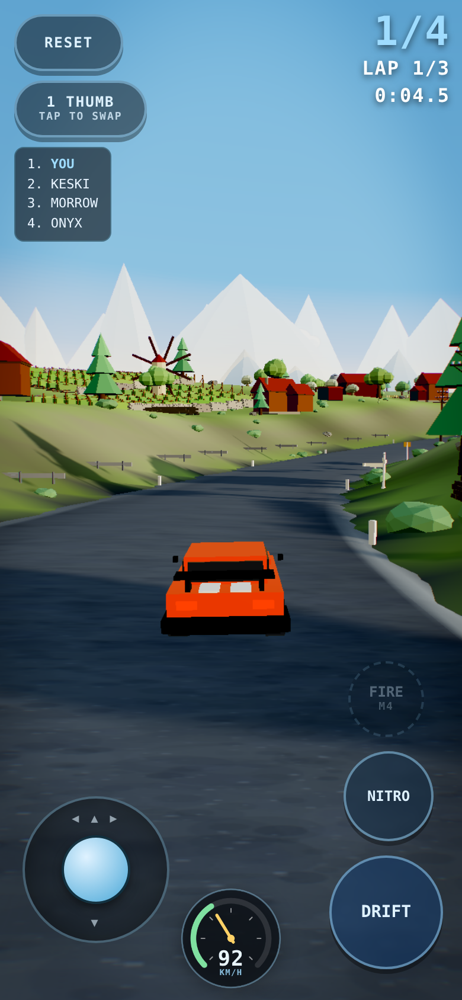
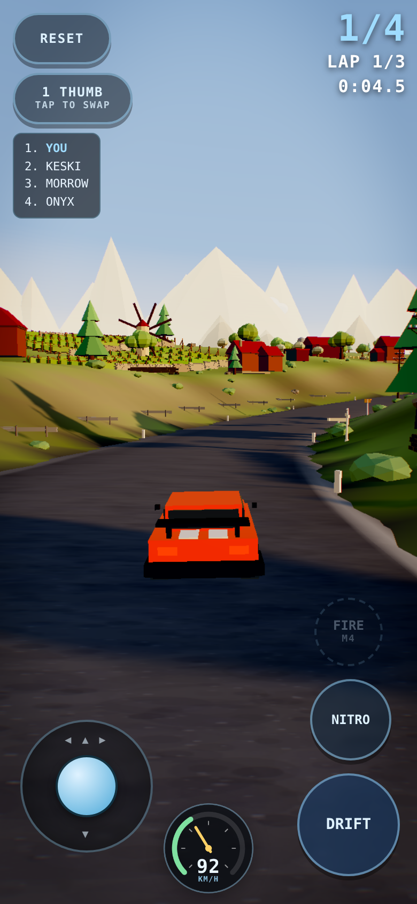
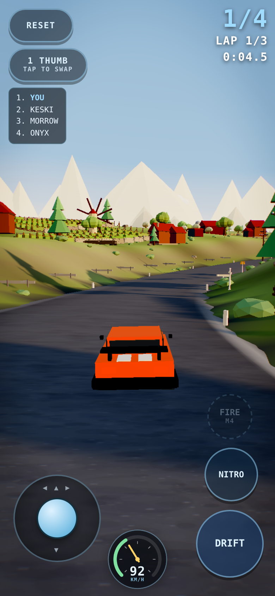
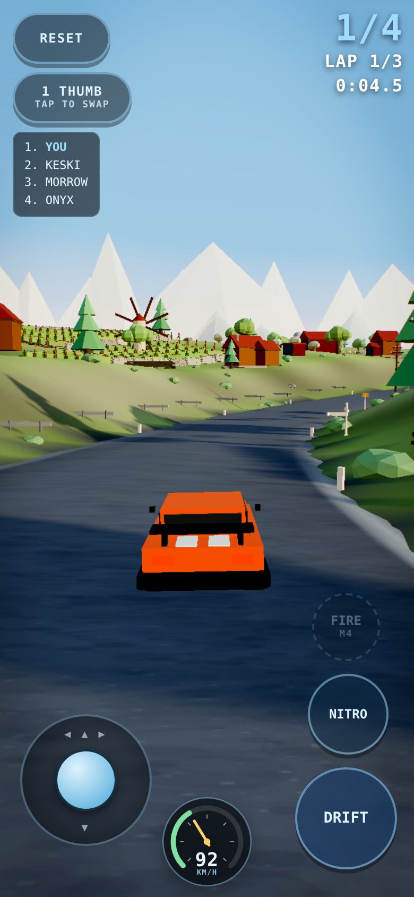

# Lighting contact sheet — harbour

Same camera, same pose, lighting mutated live.

- **a-noon-shipped** — what shipped before tonight: 43 deg sun, 1.0 fill
  sun [-90,90,-30] @ 2.3, fill 1

  
- **b-golden-12** — presets golden: 12 deg, fill 0.8 — the too-dark one
  sun [-160,34,20] @ 2.9, fill 0.8

  
- **c-golden-28-warmfill** — 28 deg, warmer and stronger fill to lift the shadow side
  sun [-150,80,30] @ 3.1, fill 1.25

  
- **d-afternoon-35** — 35 deg, warm but not sunset — shadows beside, not under
  sun [-130,95,40] @ 3, fill 1.2

  
- **e-golden-backlit** — sun toward the camera: rim light and long shadows forward
  sun [150,42,-60] @ 3.2, fill 1.15

  
- **f-mediterranean-noon** — high but WARM, strong fill — the vineyard reference
  sun [-80,130,40] @ 3, fill 1.3

  